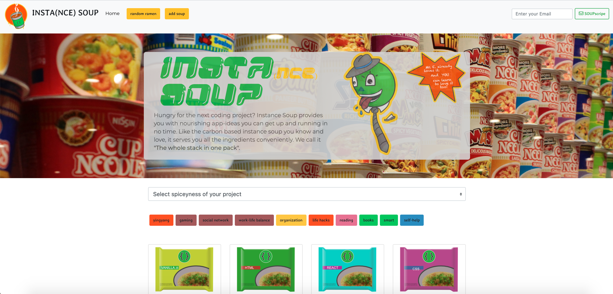

# INSTA(NCE) SOUP API

Insta(nce) soup is a different take on a classic code project, the creation of a recipe repository with detail views for each entry.
Here, the "recipes" are comprised of little code challenges, each categorized by their spiciness (difficulty level) and the technologies used to solve them.
Apart from serving all recipies/technologies back to the client, it is also possible to get a pre-filtered response based on query strings.

## Technologies

- ES6
- Node
- Express

## Database (ElephantSQL)

#### author

|    id     |    name     |
| :-------: | :---------: |
| serial PK | varchar(50) |

#### recipe

|    id     | author_id |    title    |  abstract   | date_created |  spiciness  | description  |   main_text   | code_snippet |   img_url    |
| :-------: | :-------: | :---------: | :---------: | :----------: | :---------: | :----------: | :-----------: | :----------: | :----------: |
| serial PK |    FK     | varchar(35) | varchar(70) |     date     | varchar(20) | varchar(550) | varchar(1230) | varchar(100) | varchar(100) |

#### technology

|    id     |    name     |
| :-------: | :---------: |
| serial PK | varchar(50) |

#### recipe_technology

| recipe_id | technology_id |
| :-------: | :-----------: |
|    FK     |      FK       |

## Features

| Endpoint                      | Routes                        |
| ----------------------------- | :---------------------------- |
| GET (all recipes)             | /recipes                      |
| GET (single recipe by id)     | /recipes/:id                  |
| GET (all technologies)        | /technologies                 |
| GET (single technology by id) | /technologies/:id             |
| GET (filter recipes)          | /filter/?name=""&spiciness="" |
